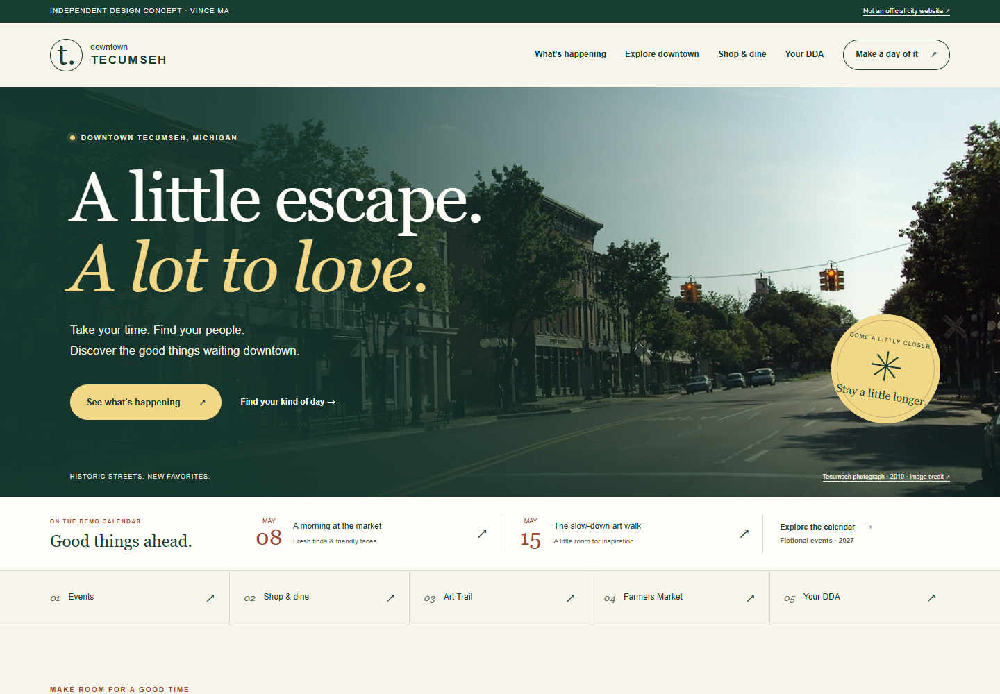

# Downtown, together — Tecumseh concept

An independent, unsolicited website concept by Vince Ma. **Not an official City of Tecumseh or Downtown Development Authority website.** This is a portfolio demonstration, not commissioned work, a completed client engagement, an endorsement, or evidence of meeting the RFP's completed-project requirement.

## Try the experience

[Open the live demonstration](https://gasmonkey28.github.io/tecumseh-downtown-concept/)



The interface starts in **May 2027**, a fixed demonstration month. All six event records and four business profiles are fictional. No actual event dates, merchants, opening hours, addresses, tickets or availability are asserted.

1. Browse the May events, filter Arts & culture, and open an event detail.
2. Switch to Calendar and move to June. Search works in both views.
3. Search businesses for `coffee`, or choose a category. Try a query with no match.
4. Explore the dedicated Art Trail and Farmers Market sections.
5. Filter events to May 10–20, reset the filters, or open a direct event link.
6. Select a numbered Art Trail stop and expand market FAQs.
7. Switch between the three sample day plans and open a business preview.
8. Try mobile navigation, keyboard controls, Escape to dismiss details and reduced-motion preference.

## What this demonstrates

- Event-first homepage and visitor-centered information hierarchy.
- Searchable business directory and reusable detail patterns.
- Responsive visual design with a credited public-domain Tecumseh street photograph and original SVG/CSS artwork.
- Native dialog, semantic headings, form labels, focus indicators, result announcements and reduced-motion support.
- A small, dependency-free static implementation in HTML, CSS and JavaScript.

The palette, typography and visual treatment are **design proposals**, not approved City branding. The hero uses a public-domain archival street photograph from 2010; all sculpture, produce, business and trail illustrations are original abstractions. See [image credits](CREDITS.md) for rights and context, and [design rationale](DESIGN.md) for research and RFP coverage. No City logo, analytics, trackers, remote fonts, API keys or paid services are used.

## Honest scope

This prototype has **no CMS, staff authentication, persistence, recurring-event authoring, production form submissions, bookings, payments or hosting/support SLA**. Date and category filtering use an in-browser sample data set. The illustrated trail is not navigational; its three stops and all event/business records are fictional. Market and DDA links lead to verified official public resources. The mood-based day planner is a small interactive proposal, not a route or availability guarantee.

Accessibility features are included and tested as documented in `QA.md`; this is not a WCAG conformance certification. A complete project would require approved content, a suitable CMS, accessibility review, migration and redirects, training, security/backup/recovery planning, and an agreed long-term support scope.

## Run locally

With a supported Node.js runtime, no dependency installation is needed:

```sh
npm start
# http://127.0.0.1:4173
npm test
```

Opening the HTML directly using `file://` will not reliably load JavaScript modules. Serve the directory over HTTP. GitHub Pages can publish the repository root with no build step.

## Files

- `index.html`: content structure and clearly visible demonstration labels
- `styles.css`: responsive design and original CSS illustrations
- `data.js`: fictional data and pure search/calendar helpers
- `app.js`: client-side controls, rendering and detail dialogs
- `assets/`: original concept illustrations, credited archival photograph and preview screenshot
- `DESIGN.md` / `CREDITS.md`: research, RFP mapping and attribution
- `tests/data.test.mjs`: search intersection and calendar edge cases
- `scripts/serve.mjs`: local-only preview server

## Source context and authorship

The feature priorities were informed by the [official RFP announcement](https://www.downtowntecumseh.com/events/RFP%20for%20Downtown%20Tecumseh%20Website%20redesign) and the September 14, 2026 RFP, especially sections 7–15 and 28. The live [official Downtown Tecumseh website](https://www.downtowntecumseh.com/) remains the source for visitor information. No official documents, private correspondence or bidder contact records are included in this repository.

Prepared for Vince Ma with AI-assisted implementation using Codex. This repository documents the actual demo scope; it does not claim an unaided development process, historical municipal experience or a client engagement.
